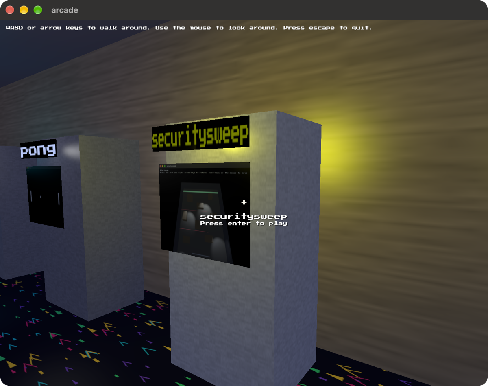

# arcade

A room with a cabinet for every game built on blitzkit. Walk up to one and press
enter to play it.



```
cargo run --release
```

Each cabinet wears its game's own screenshot and runs its own binary, so every
game still runs on its own from its own folder exactly as before. One plays at a
time.

The engine's own shapes stand on plinths at the far end. Off the left wall past
the last cabinet there's a nook with a bench in it, and on the bench a Newton's
cradle you can set going.

Inside `blitzkit-project` this builds against the engine checkout rather than
the published crate, because of the `[patch.crates-io]` in
`blitzkit-project/.cargo/config.toml`.

---

I asked AI to draft this for me. I've edited it. Any surviving AI smells are my oversight.
